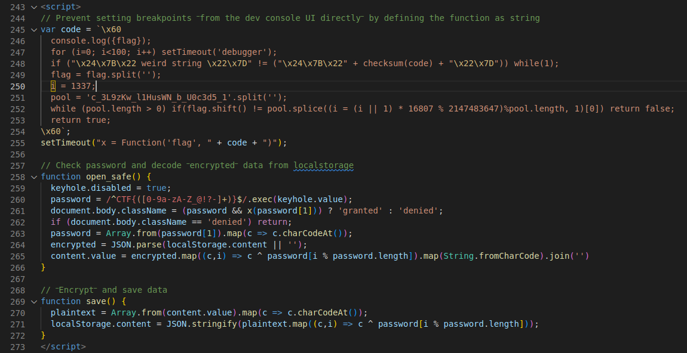
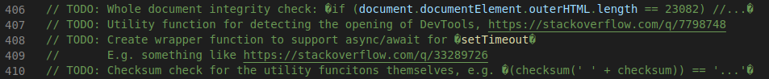
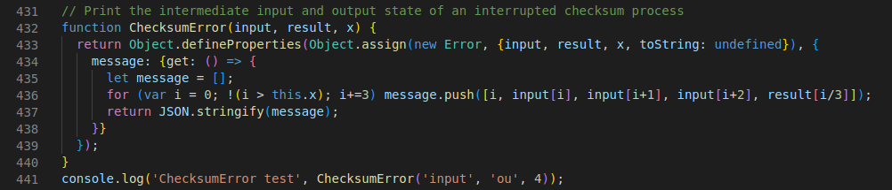

Google CTF 2022 was my first jeopardy CTF with KITCTF.
This is my write-up for the challenge Js Safe 4.0.

- **Source:** [GitHub](https://github.com/Ik0ri4n/google-ctf-22-write-ups/blob/main/js-safe-4dot0/writeup.md)
- **Category:** reversing
- **Points:** 152pt
- **Date:** Fri, 01 July 2022, 18:00 UTC - Sun, 03 July 2022, 18:00 UTC
- **Attachments:** [js_safe_4.html](../files/googlectf22/jssafe/js_safe_4.html) ([zip](../files/googlectf22/jssafe/attachments.zip))
- **Write-Up author:** Dominik Waibel
- **Description:**

> You stumbled upon someone's "JS Safe" on the web. It's a simple HTML file that can store secrets in the browser's localStorage. This means that you won't be able to extract any secret from it (the secrets are on the computer of the owner), but it looks like it was hand-crafted to work only with the password of the owner...

## TL;DR

The challenge page is a browser local secret safe which contains obfuscated password check code.
We can analyze this code using the debugger and code editors to extract the password (also the flag).

## First observations

The challenge consists of a single HTML file containing the code for a browser-local safe for storing secrets with a password login.
As it only uses local code, the password for the page (also the flag) is hidden in the login code.
It is our task to work through the obfuscation and find it.
I highly recommend to use an editor like VS Code and the debugger for solving this challenge.


The HTML page contains a simple page structure with a login field (in l. 375-382), some javascript code (in l. 243-273 and l. 384-442) and a lot of irrelevant HTML and CSS for an animated background.



The first script block contains the function `openSafe()` which checks the password against the flag format and validates the text inside of the brackets with the function `x()`.
This second function is defined from a `code` string with a call to `setTimeout()`.
Trying to reconstruct the flag from the code snippet does only result in nonsense like `s__3Wb15l_L_3uU19d0HNzcKw_c` though.
(If you get different results, note that `i` is 100 after the `for`-loop and that the assignment at line 250 does not modify `i` as it has a ZERO WIDTH JOINER appended.)

The second script block contains some supposed utility functions that appear legitimate on the first glance.
Additionally it contains a weirdly colored comment (I will return to that later).

## First part of the flag

I used the debugger to quickly check assumptions and test code.
Opening it on the challenge page freezes the tab but can usually be circumvented by stopping the page (most browsers will offer you to do this after a few seconds).

Analyzing the `code` variable one may note that it is a [template literal](https://developer.mozilla.org/en-US/docs/Web/JavaScript/Reference/Template_literals) with hex-encoded characters, like `\x60` - another backtick.
When you evaluate the first template literal with `console.log(code)` it produces another template literal.
This literal uses [string interpolation](https://developer.mozilla.org/en-US/docs/Web/JavaScript/Reference/Template_literals#string_interpolation) and appends the result of `checksum(code)` to the string.
In the script block the first template literal is evaluated by the string concatenation in `setTimeout("x = Function('flag', " + code + ")")` and the second by the `Function` constructor.
Evaluating `checksum(code)` produces a string that contains javascript code manipulating the variable `i`.
At this pint I had the idea to **look at the produced code for `x` via `console.log(x+'')`** [^1]:

```js
function anonymous(flag) {
  console.log({ flag });
  for (i = 0; i < 100; i++) setTimeout("debugger");
  if (
    ("Some string" != "Another string",
    (i += ((x + "").length + 12513) | 1),
    !"A third string containing weird chars")
  )
    while (1);
  flag = flag.split("");
  i‍ = 1337;
  pool = "c_3L9zKw_l1HusWN_b_U0c3d5_1".split("");
  while (pool.length > 0)
    if (
      flag.shift() !=
      pool.splice((i = ((i || 1) * 16807) % 2147483647) % pool.length, 1)[0]
    )
      return false;
  return true;
}
```

Derived from this function we can output the correct flag string for x using the following code:

```js
i = 100 + (x + "").length + 12513;
flag = "";
pool = "c_3L9zKw_l1HusWN_b_U0c3d5_1".split("");
while (pool.length > 0)
  flag += pool.splice(
    (i = ((i || 1) * 16807) % 2147483647) % pool.length,
    1
  )[0];
console.log(flag);
```

This returns the first part of the flag `W0w_5ucH_N1c3_d3bU9_sK1lLz_`, hinted by the trailing underscore.
We still get "Access Denied" upon login.

## Second part of the flag

Next I returned to the weird comments on lines 406-410.
(Another thing that may hint you to those lines is that modifying the length of the page may give you "Access Granted" with just the first flag part and that those comments _discuss_ a length check.)



The code in those line comments is wrapped with a LINE SEPARATOR and is thus **evaluated like code on the next line**.
To see what it does I again printed the code passed to `setTimeout()` with `console.log(checksum(' ' + checksum))`[^1]:

```js
function anonymous() {
  pA: Object.defineProperty(document.body, "className", {
    get() {
      return this.getAttribute("class") || "";
    },
    set(x) {
      this.setAttribute(
        "class",
        x != "granted" ||
          (/^CTF{([0-9a-zA-Z_@!?-]+)}$/.exec(keyhole.value) || x)[1].endsWith(
            "Br0w53R_Bu9s_C4Nt_s70p_Y0u"
          )
          ? x
          : "denied"
      );
    },
  });
}
```

This function **redefines the class setter of `document.body`** and checks the end of the flag.
So we now have the **complete flag `CTF{W0w_5ucH_N1c3_d3bU9_sK1lLz_Br0w53R_Bu9s_C4Nt_s70p_Y0u}`**.

## Conclusion

The challenge obviously shows that, however deep it is hidden in code obfuscation, a password is never safe if it is checked browser-locally.
In general, sensitive information should only be included in web pages for users that are supposed to get access to them.

## Interesting additions

Since the page code only checks the start and end of the flag string there is actually an infinite amount of valid passwords, like `CTF{W0w_5ucH_N1c3_d3bU9_sK1lLz_AWESOME_CHALLENGE_Br0w53R_Bu9s_C4Nt_s70p_Y0u}` for example.

The code snippet causing the freeze of the page is:



As `this.x` is undefined in this method and a comparison to `undefined` is always evaluated to `false` the `for`-loop is essentially an infinite loop.
Since the calls `console.log()` are evaluated when opening the debugger the call in line 441 causes the page freeze.
You can comment it out to avoid the freeze but should then remove two characters somewhere to preserve the core functionality of the page.

[^1]: I reformatted the code, shortened irrelevant strings and removed random comments.